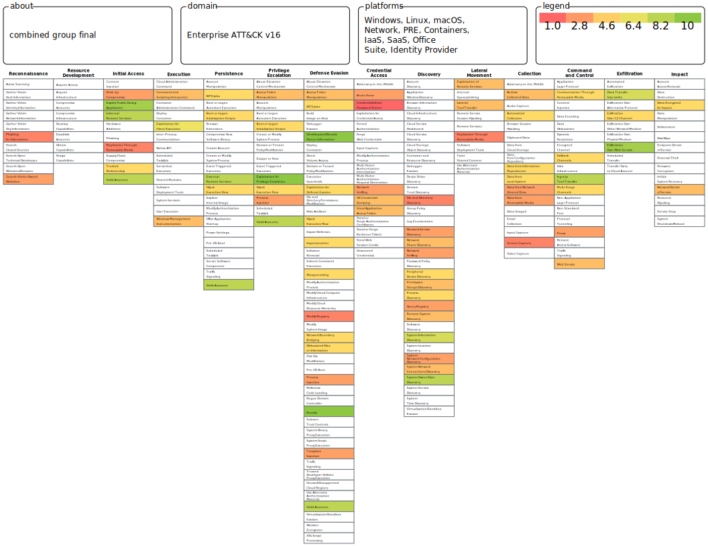

# **MITRE ATT&CK Framework Analysis: APT Group Comparison**

## **1. Introduction**  
Advanced Persistent Threat (APT) groups pose significant cybersecurity risks to organizations worldwide. This report analyzes and compares the attack techniques of **two well-known APT groups** using the **MITRE ATT&CK** framework. The objective is to identify their **tactics, techniques, and tools**, visualize them using **MITRE ATT&CK Navigator**, and assign a **scoring system** to evaluate the severity and frequency of their attack techniques.

---

## **2. APT Group Identification**  

Based on research and provided hints, the APT groups analyzed in this report are:  

### **Group 1: APT29 (Cozy Bear)**  
- **State-sponsored** cyber-espionage group linked to **Russia**.  
- Targets **government entities, military organizations, and the defense sector**.  
- **Common Techniques:**  
  - **Spear Phishing (T1566.001)** – Delivering malicious attachments or links.  
  - ==**Phishing for information (T1598)**== -  send phishing messages to elicit sensitive information that can be used during targeting
  - **Credential Dumping (T1003)** – Extracting stored credentials for lateral movement.  
  - **Exploiting Public-Facing Applications (T1190)** – Leveraging vulnerabilities in exposed systems.  
  - ==**Network Denial of Service (T1498)**== – Impacting service availability.  

### **Group 2: APT41 (Winnti Group)**  
- **Highly versatile** group conducting **espionage and financially motivated attacks**.  
- Known for **supply chain compromises, ransomware, and sophisticated malware**.  
- **Common Techniques:**  
  - **Supply Chain Compromise (T1195)** – Injecting malicious code into trusted software.  
  - **Ransomware Deployment (T1486)** – Encrypting victim data for extortion.  
  - ==**Search Victim-Owned Websites (T1596)**== – Reconnaissance for publicly available data.  
  - ==**Data Encrypted for Impact (T1486)**== – Causing financial and operational disruption.  

---

## **3. MITRE ATT&CK Navigator Analysis**  

The **MITRE ATT&CK Navigator** was used to visualize and analyze attack techniques for both groups:  
### Group 1 - APT28:
#### Screenshot:
.svg)

### Group 2 - APT41:
.svg)
### Combined a+b:

### **Key Observations**  
- **Common techniques**: Both groups use **reconnaissance, credential access, and impact techniques**.  
- **Differences**:  
  - ==**APT29**== is **espionage-focused** and targets **governments** and **defense** sectors.  
  - ==**APT41**== conducts **both espionage and financial attacks**, including **ransomware**.  

---

## **4. Scoring Methodology**  

A scoring system was developed to **quantify the impact and severity** of attack techniques:  

| **Criteria**             | **Description**                        | **Scale (1-5)**          |
| ------------------------ | -------------------------------------- | ------------------------ |
| **Impact**               | How damaging is the technique?         | 1 (Low) - 5 (High)       |

The scoring is applied for both the groups on ATT&CK Navigator, refer the JSON attachments.
These scores were applied in **MITRE ATT&CK Navigator** to prioritize **high-risk techniques**.

---

## **5. Importance of Understanding APT Groups**  

- **Enhancing Cybersecurity Defenses**: Organizations can **proactively defend** against threats by understanding APT tactics.  
- **Threat Intelligence Application**: Security teams can **map adversary behavior** to MITRE ATT&CK to **improve detection** and threat hunting strategies to remediate.  
- **Incident Response & Mitigation**: Knowing **common techniques** helps in **building resilient defense strategies**.  

By leveraging the **MITRE ATT&CK framework**, security teams can **better anticipate, detect, and mitigate** APT attacks.

---

## **6. Conclusion**  

This analysis compared **APT29 and APT41**, highlighting their **techniques, similarities, and differences**. By using **MITRE ATT&CK Navigator**, a **scoring system** was applied to evaluate **the most impactful attack methods**. Understanding these tactics enables **stronger cyber defense measures**.

---

## **7. Deliverables**  

📎 **Attached Files:**  
- **PDF Report** (this document)  
- JSON Files (Group 1, Group 2, Combined groups)
- **Screenshots of MITRE ATT&CK Navigator Merged Layer**  

📅 **Submission Deadline:** **February 25, 2025**  
