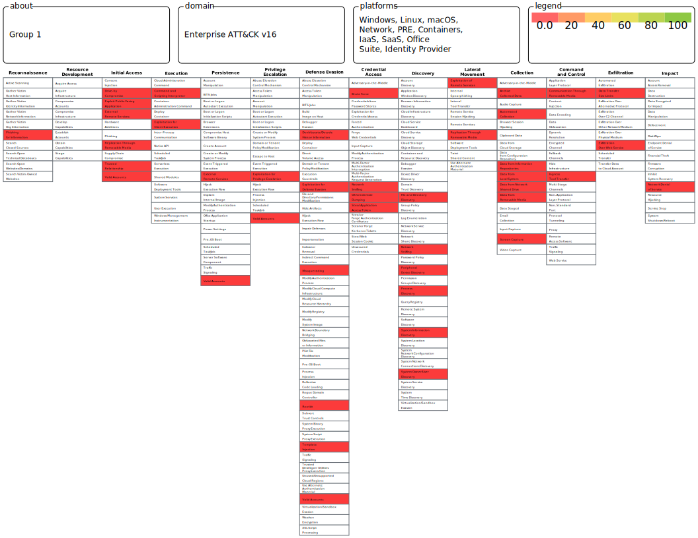
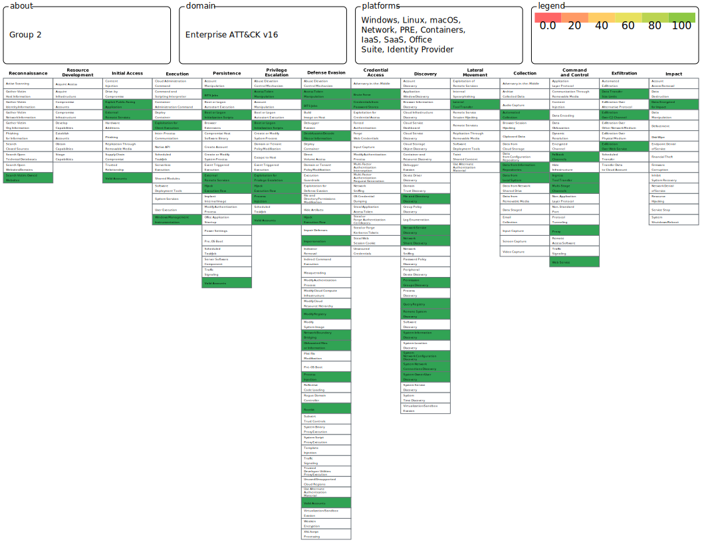

## **Objective**  
The goal of this assignment is to analyze and compare the attack techniques used by two well-known **Advanced Persistent Threat (APT) groups**. You will use the **MITRE ATT&CK Navigator** to identify the attack techniques associated with these groups, visualize them on separate layers, merge the layers into a single view, and assign a **scoring system** to the techniques.

---

## **Instructions**  

### **1. Identify the APT Groups**  
- Based on the provided hints, determine the two **APT groups** being referenced.  
- Research their known **attack techniques, tactics, and tools**.  
- Some hints about these APT groups:  

#### **Group 1:**  
- This group is believed to be **state-sponsored** and primarily engages in **cyber-espionage**.  
- It targets **government entities, military organizations, and the defense sector**.  
- Known for:  
  - **Spear phishing**  
  - **Credential dumping**  
  - **Exploiting public-facing applications**  
- **Reconnaissance:** Phishing for Information  
- **Impact:** Network Denial of Service  

#### **Group 2:**  
- This group is **highly versatile**, conducting both **espionage and financially motivated attacks**.  
- It has been involved in:  
  - **Supply chain compromises**  
  - **Ransomware deployments**  
  - **Sophisticated malware attacks**  
- **Reconnaissance:** Search Victim-Owned Websites  
- **Impact:** Data Encrypted for Impact  

---

### **2. Use MITRE ATT&CK Navigator**  
- Open the **[MITRE ATT&CK Navigator](https://mitre-attack.github.io/attack-navigator/)** tool.  
- **Identify and create a layer** for **Group 1**, highlighting its known attack techniques.  
- **Identify and create a layer** for **Group 2**, highlighting its known attack techniques.  
- **Merge these two layers** into a single layer to visualize all techniques together.  

---

### **3. Scoring the Techniques**  
- Develop a **scoring system** to evaluate the **severity** or **frequency** of each attack technique.  
- Example scoring criteria (scale of 1-5):  
  - **Impact** (High = 5, Low = 1)  
  - **Ease of Execution** (Easier = Higher score)  
  - **Detection Difficulty** (Harder to detect = Higher score)  
- Apply your **scoring system** to the **merged layer** in MITRE ATT&CK Navigator.  

---

### **4. Deliverables**  
- **Screenshot** of the merged layer in **MITRE ATT&CK Navigator**.  
- A **short report (1-2 pages)** explaining:  
  - The **key attack techniques** used by each group.  
  - **Differences and similarities** between these groups.  
  - Your **chosen scoring methodology** and justification.  
  - A **brief discussion** on how understanding APT groups enhances cybersecurity defenses.  

---

## **Submission Format**  
- **Document:** PDF or Word file containing the explanation and screenshots.  
- **Navigator Layer File:** Export the **merged layer** as a JSON file and attach it to your submission.  

---

## **Deadline**  
📅 **February 25, 2025**  

---

## **Evaluation Criteria**  
| **Criteria** | **Weight** | **Description** |
|-------------|------------|----------------------------------------------------|
| **APT Group Identification** | **20%** | Correctly determining the groups based on hints. |
| **Correct Use of MITRE ATT&CK Navigator** | **30%** | Proper visualization and merging of layers. |
| **Scoring Justification** | **30%** | Logical and well-explained scoring methodology. |
| **Presentation & Clarity** | **20%** | Clear and concise explanation with well-organized content. |

---

### **Additional Resources**  
- **MITRE ATT&CK Framework:** [https://attack.mitre.org](https://attack.mitre.org)  
- **MITRE ATT&CK Navigator:** [https://mitre-attack.github.io/attack-navigator/](https://mitre-attack.github.io/attack-navigator/)  

---
# **MITRE ATT&CK Framework Analysis: APT Group Comparison**

## **1. Introduction**  
Advanced Persistent Threat (APT) groups pose significant cybersecurity risks to organizations worldwide. This report analyzes and compares the attack techniques of **two well-known APT groups** using the **MITRE ATT&CK** framework. The objective is to identify their **tactics, techniques, and tools**, visualize them using **MITRE ATT&CK Navigator**, and assign a **scoring system** to evaluate the severity and frequency of their attack techniques.

---

## **2. APT Group Identification**  

Based on research and provided hints, the APT groups analyzed in this report are:  

### **Group 1: APT29 (Cozy Bear)**  
- **State-sponsored** cyber-espionage group linked to **Russia**.  
- Targets **government entities, military organizations, and the defense sector**.  
- **Common Techniques:**  
  - **Spear Phishing (T1566.001)** – Delivering malicious attachments or links.  
  - ==**Phishing for information (T1598)**== -  send phishing messages to elicit sensitive information that can be used during targeting
  - **Credential Dumping (T1003)** – Extracting stored credentials for lateral movement.  
  - **Exploiting Public-Facing Applications (T1190)** – Leveraging vulnerabilities in exposed systems.  
  - ==**Network Denial of Service (T1498)**== – Impacting service availability.  

### **Group 2: APT41 (Winnti Group)**  
- **Highly versatile** group conducting **espionage and financially motivated attacks**.  
- Known for **supply chain compromises, ransomware, and sophisticated malware**.  
- **Common Techniques:**  
  - **Supply Chain Compromise (T1195)** – Injecting malicious code into trusted software.  
  - **Ransomware Deployment (T1486)** – Encrypting victim data for extortion.  
  - ==**Search Victim-Owned Websites (T1596)**== – Reconnaissance for publicly available data.  
  - ==**Data Encrypted for Impact (T1486)**== – Causing financial and operational disruption.  

---

## **3. MITRE ATT&CK Navigator Analysis**  

The **MITRE ATT&CK Navigator** was used to visualize and analyze attack techniques for both groups:  
### Group 1 - APT28:
#### Screenshot:

### Group 2 - APT41:

### **Key Observations**  
- **Common techniques**: Both groups use **reconnaissance, credential access, and impact techniques**.  
- **Differences**:  
  - ==**APT29**== is **espionage-focused** and targets **governments** and **defense** sectors.  
  - ==**APT41**== conducts **both espionage and financial attacks**, including **ransomware**.  

---

## **4. Scoring Methodology**  

A scoring system was developed to **quantify the impact and severity** of attack techniques:  

| **Criteria** | **Description** | **Scale (1-5)** |
|-------------|----------------|----------------|
| **Impact** | How damaging is the technique? | 1 (Low) - 5 (High) |
| **Ease of Execution** | How easily can an attacker execute it? | 1 (Difficult) - 5 (Easy) |
| **Detection Difficulty** | How hard is it to detect? | 1 (Easy) - 5 (Hard) |

### **Scoring Example**  
| **Technique** | **Impact** | **Ease of Execution** | **Detection Difficulty** | **Total Score** |
|--------------|-----------|------------------|--------------------|-------------|
| Spear Phishing (T1566.001) | 5 | 4 | 4 | 13 |
| Credential Dumping (T1003) | 4 | 3 | 5 | 12 |
| Exploiting Public-Facing Apps (T1190) | 5 | 5 | 3 | 13 |
| Ransomware (T1486) | 5 | 4 | 5 | 14 |

These scores were applied in **MITRE ATT&CK Navigator** to prioritize **high-risk techniques**.

---

## **5. Importance of Understanding APT Groups**  

- **Enhancing Cybersecurity Defenses**: Organizations can **proactively defend** against threats by understanding APT tactics.  
- **Threat Intelligence Application**: Security teams can **map adversary behavior** to MITRE ATT&CK to **improve detection** and threat hunting strategies to remediate.  
- **Incident Response & Mitigation**: Knowing **common techniques** helps in **building resilient defense strategies**.  

By leveraging the **MITRE ATT&CK framework**, security teams can **better anticipate, detect, and mitigate** APT attacks.

---

## **6. Conclusion**  

This analysis compared **APT29 and APT41**, highlighting their **techniques, similarities, and differences**. By using **MITRE ATT&CK Navigator**, a **scoring system** was applied to evaluate **the most impactful attack methods**. Understanding these tactics enables **stronger cyber defense measures**.

---

## **7. Deliverables**  

📎 **Attached Files:**  
- **PDF Report** (this document)  
- **MITRE ATT&CK Navigator Layer (JSON file)**  
- **Screenshots of MITRE ATT&CK Navigator Merged Layer**  

📅 **Submission Deadline:** **February 25, 2025**  
