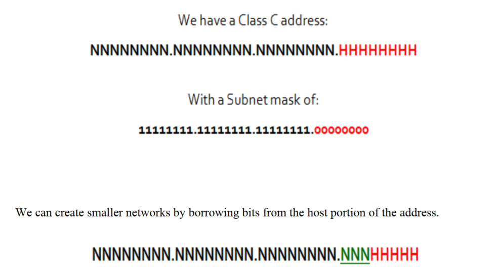
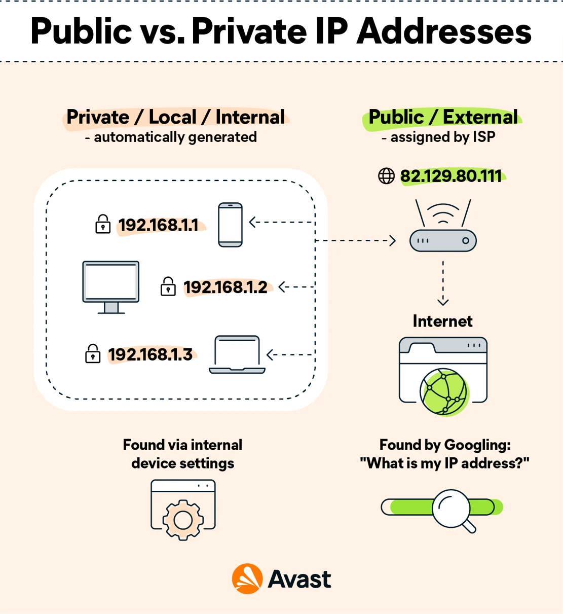

# Introduction to Networks

## IP Address

* Each digitally connected device is recognized using a unique assigned IP Address, using which devices can connect and communicate with it.
* IP addresses are of IPv4 and IPv6.
* IPv4 is made up of 32 bits of four octets (8 characters) or 4 groups of 8 bits (1 byte).


Example of ipv4 - 192.168.1.101


IPv4 are 32-bit numerical addresses represented in dotted decimal format.

* Each section in IPv4 is called octet and consists of 8 bits and can range from 0 to 255 (8bit x 4 dotted decimals = 32bit)
* Total number of unique addresses sizes up to 2^32 (4.3 billion)
* Due to rapid growth of internet and multiple devices with each person and IoT, the number of IPv4 addresses has become limited.

<figure><figcaption></figcaption></figure>

###

###

### Private and Public IP address are different in usage.

* A **private IP address**, such as a home or office network, is assigned to a device on a local network and is used to identify the device within that network.
* A **public IP address** is assigned to a device directly connected to the internet and is used to identify the device on the internet.

<figure><figcaption></figcaption></figure>

