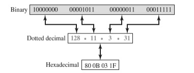
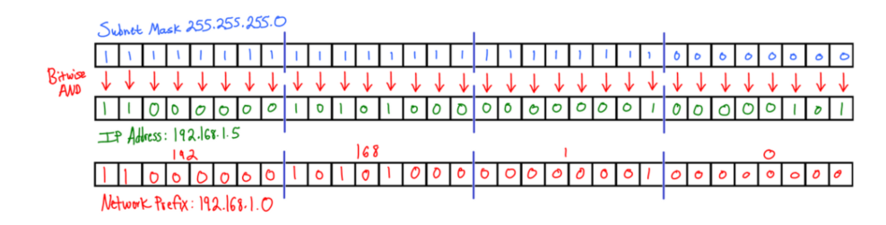
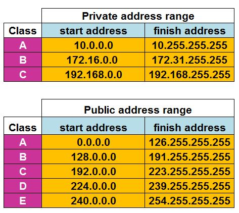
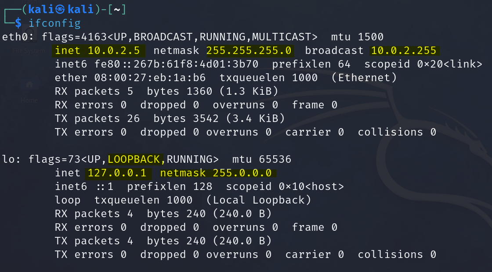

# Introduction to Networks

## IP Address

* Each digitally connected device is recognized using a unique assigned IP Address, using which devices can connect and communicate with it.
* IP addresses are of IPv4 and IPv6.
* IPv4 is made up of 32 bits of four octets (8 characters) or 4 groups of 8 bits (1 byte).


Example of ipv4 - 192.168.1.101


IPv4 are 32-bit numerical addresses represented in dotted decimal format.

* Each section in IPv4 is called octet and consists of 8 bits and can range from 0 to 255 (8bit x 4 dotted decimals = 32bit)
* Total number of unique addresses sizes up to 2^32 (4.3 billion)
* Due to rapid growth of internet and multiple devices with each person and IoT, the number of IPv4 addresses has become limited.

<figure><figcaption>
IPv4 notations
</figcaption></figure>

### Classes of IP address

Generally classified into three classes A, B and C. The ranges of each class is:

* **Class A - **<mark style="color:yellow;">**0.0.0.0 to 127.255.255.255**</mark>
* **Class B** - <mark style="color:yellow;">128.0.0.0 - 191.255.255.255</mark>
* **Class C** - <mark style="color:yellow;">192.0.0.0 - 223.255.255.255</mark>

## Subnetting

Subnetting lets network administrators use the 32 bits in IPv4 IP address space **more efficiently**. They can create sub-nets within a Class A, B, or C network.

Using subnetting gives a flexible way to designate which portion of IP represents network ID.

### Subnets

A subnet is a network within a network namely Class A or B or C. Subnets are created using one or more of the host bits (right part of IP address, after network ID) to extend network ID.

Class A networks have an 8-bit network ID.

Class B has a standard 16-bit network ID

Class C has a standard 24-bit network ID.&#x20;

Subnetting enables us to create network ID's of any size.

<figure><figcaption></figcaption></figure>

The number of subnets available and the number of possible hosts in a network may be readily calculated. For instance, the _192.168.5.0/24_ network may be subdivided into the following four _/26_ subnets. The highlighted two address bits become part of the network number in this process.

| Network          | Network (binary)                      | Broadcast address |
| ---------------- | ------------------------------------- | ----------------- |
| 192.168.5.0/26   | `11000000.10101000.00000101.00000000` | 192.168.5.63      |
| 192.168.5.64/26  | `11000000.10101000.00000101.01000000` | 192.168.5.127     |
| 192.168.5.128/26 | `11000000.10101000.00000101.10000000` | 192.168.5.191     |
| 192.168.5.192/26 | `11000000.10101000.00000101.11000000` | 192.168.5.255     |

The remaining bits after the subnet bits are used for addressing hosts within the subnet. In the above example, the subnet mask consists of $$26$$ bits, making it 255.255.255.192, leaving 6 bits for the host identifier. This allows for 62 host combinations ($$2^6 - 2$$).

In general, the number of available hosts on a subnet is $$2^h - 2$$, where _h_ is the number of bits used for the host portion of the address. The number of available subnets is $$2^n$$, where _n_ is the number of bits used for the network portion of the address.

### Subnet Mask

Subnet masks use the 32-bit structure of the IP address. The subnet mask tells us which bits are for the Network ID and which bits are for the host ID. When the subnet mask bit is set to one, this means it is part of the network. A bit marked as zero is part of the host ID.\

<figure><figcaption></figcaption></figure>

### IPv4 Classless Inter-Domain Routing (CIDR)

The size of the prefix, in bits, is written after the oblique. This is called “slash notation”. There is a total of 32 bits in IPv4 address space. For example, if a network has the address “192.0.2.0/24”, the number “**24**” refers to how many bits are **contained in the network.**&#x20;

From this, the number of bits left for address space can be calculated. As all IPv4 networks have 32 bits, and each “section” of the address denoted by the decimal points contains eight bits, “192.0.2.0/24” **leaves eight bits to contain host addresses.** This is enough space for 256 host addresses. These host addresses are the IP addresses that are necessary to connect your machine to the Internet.

A network numbered “10.0.0.0/8” (which is one of those reserved for private use) is a network with eight bits of network prefix, denoted by “/8” after the oblique. <mark style="color:green;">The “8” denotes that there are 24 bits left over in the network to contain IPv4 host addresses: 16,777,216 addresses to be exact.</mark>

<figure><figcaption></figcaption></figure>

<figure><figcaption></figcaption></figure>

Those 3 bits would give us $$2^3 - 2$$ (we need to subtract for the reserved network and broadcast IP) subnets or 6. There would be 5 bits left in the network portion of the address or $$2^5 - 2$$ or 30 hosts per subnet.

Subnet mask = **255.255.255.224 (128+64+32 = 224)**


Every IP address with host ID = 0 is assigned to network as network ID.

Every IP address with host ID = 255 is assigned as broadcast address of that network.


#### CIDR Chart

<figure><figcaption>
CIDR chart using IPv4
</figcaption></figure>

***

### Public vs Private IP address

> From 2^32 around 4.3 billion IP addresses, there are 7.5 billion people and each of them posses multiple devices connected to the internet


There are not enough IP addresses available to cover all the devices to the internet. Given the rise of Smart Devices, Then how are we using IP addresses with so many devices??


Due to this problem, a system was developed to reuse a group of IP Addresses within a LAN (Local Area Network) which are not usable in the internet. They are available to use only within the LAN.

* Private and Public IP address are different in usage.
* A **private IP address**, such as a home or office network, is assigned to a device on a local network and is used to identify the device within that network.
* A **public IP address** is assigned to a device directly connected to the internet and is used to identify the device on the internet.

The list of Public and Private IP Addresses is as below:

<figure><figcaption>
Public and Private IP Address range
</figcaption></figure>

#### Example of Private vs Public IP address

<figure><figcaption>
Example of how Private and Public IP addresses behave
</figcaption></figure>

In Kali Linux, we use `ifconfig` to see IP addresses on the interfaces. The private IP address begins with 192.168.x.x or 10.X.X.X based on the network configuration set to the kali machine.

<figure><figcaption></figcaption></figure>

