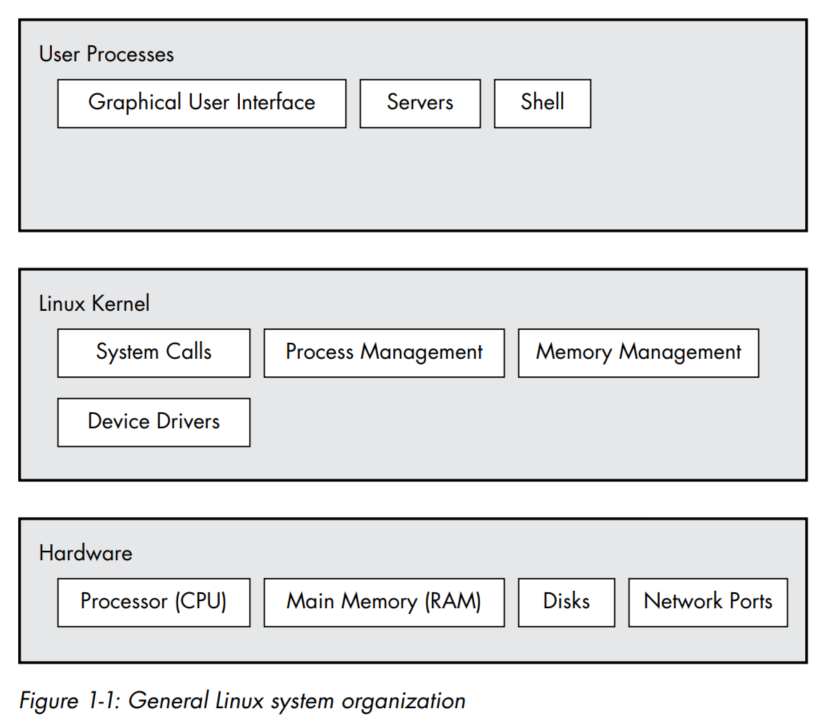
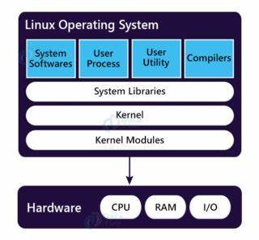

# Why is Linux complicated?

There could be a web server communicating with database server using programs which uses shared libraries, This is all managed by operating system using **ABSTRACTION**.

When riding a car we don't think about how a particular bolt holds the motor or seats inside the car, we ignore the minute details and mechanisms of the car. Rather we focus on how to drive and move from A to B.

Similarly dev's use abstraction as a tool when building such complicated operating systems (Agree?? Linus Torvalds?)

Coming from a ex-developer, there are different terms for an abstracted subdivision like packages in python, header files or libraries in C/C++, modules etc.,

## Levels of Abstraction in Linux

3 main levels of abstraction in Linux.

1. Hardware - includes memory, CPU and storage disks (you know, just hardware (don't complicate or over think with cloud.))
2. KERNEL - OG/Core of Operating System. Does many crucial things, hold on.
3. Processes - Programs running managed by Kernel.
	1. User Space
	2. Kernel Space

### Hardware - Main Memory (RAM, JAI SRI RAM <3)

- Main memory is just a high-speed, volatile storage area which contains 0's and 1's. (Binary data bro, data stored in binary).
- Bit - either 0 or 1.
- Byte - 8 bits
- Main memory is where kernel interacts and instructs CPU to perform operations and share the results or interact with Input/Output.
- The input and output from peripheral devices in a computer system are channeled through main memory, treated as a collection of bits manipulated by the CPU. In computer systems, a "state" refers to the arrangement of these bits, often described abstractly based on the actions or stages of processes rather than their binary representation. (yes, I used ChatGPT definition)

### Kernel - heart of linux

We discuss main memory and states because they form the foundation of the kernel's operations. 

The kernel's tasks, includes
- Process Management
- Memory Management
- Device Driver Management
- system call handling

The kernel tasks are all intimately tied to main memory and require meticulous management to ensure efficient resource utilization and process execution.

#### Process Management

start, stop, pause, resume, scheduling and terminating are some of the actions performed on programs that run on memory (process, see now you know process definition is, definitely A grade this time)

CPU has multiple cores these days, but consider a single core CPU for now, they are used to run multiple process at a same time by giving each process a fraction of time (time slice) to use CPU and perform its operations. However, because the slices are so small, we can’t perceive them, and the system appears to be running multiple processes at the same time (a capability known as **multitasking**).

>[!info]
>This is where the OG Computer Architecture and other complex, but really interesting things come up. If you're interested, you should've joined Suhas K P sir class at NIE during 2021 pandemic, LEGEND taught us idiots well, Made it really interesting for me though.

**CONTEXT SWITCHING**

The context switch answers the important question of *when* the kernel runs. The answer is that it runs *between* process time slices during a context switch

1. CPU interrupts a current process based on internal timer, switches into KERNEL MODE, and hands over the control to kernel.
2. Kernel records the current state of CPU and memory, which will be essential to resume the process that was just interrupted.
3. Kernel performs any tasks that might have come up during preceeding time slice.
4. Kernel is ready to let another process run, analyzes the list of precoesses that are ready to run and chooses one.
5. Kernel prepares memory for this new process and let this process use CPU.
6. Kernel tells CPU how long the time slice is and that's how long the new process will run.
7. The Kernel switches CPU to User mode and hands the control of CPU to process to run.