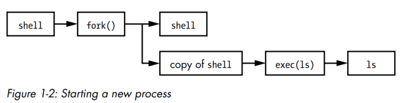

# Why is Linux complicated?

There could be a web server communicating with database server using programs which uses shared libraries, This is all managed by operating system using **ABSTRACTION**.

When riding a car we don't think about how a particular bolt holds the motor or seats inside the car, we ignore the minute details and mechanisms of the car. Rather we focus on how to drive and move from A to B.

Similarly dev's use abstraction as a tool when building such complicated operating systems (Agree?? Linus Torvalds?)

Coming from a ex-developer, there are different terms for an abstracted subdivision like packages in python, header files or libraries in C/C++, modules etc.,

## Levels of Abstraction in Linux

3 main levels of abstraction in Linux.

1. Hardware - includes memory, CPU and storage disks (you know, just hardware (don't complicate or over think with cloud.))
2. KERNEL - OG/Core of Operating System. Does many crucial things, hold on.
3. Processes - Programs running managed by Kernel.
	1. User Space
	2. Kernel Space

### Hardware - Main Memory (RAM, JAI SRI RAM <3)

- Main memory is just a high-speed, volatile storage area which contains 0's and 1's. (Binary data bro, data stored in binary).
- Bit - either 0 or 1.
- Byte - 8 bits
- Main memory is where kernel interacts and instructs CPU to perform operations and share the results or interact with Input/Output.
- The input and output from peripheral devices in a computer system are channeled through main memory, treated as a collection of bits manipulated by the CPU. In computer systems, a "state" refers to the arrangement of these bits, often described abstractly based on the actions or stages of processes rather than their binary representation. (yes, I used ChatGPT definition)

### Kernel - heart of linux

We discuss main memory and states because they form the foundation of the kernel's operations. 

The kernel's tasks, includes
- Process Management
- Memory Management
- Device Driver Management
- system call handling

The kernel tasks are all intimately tied to main memory and require meticulous management to ensure efficient resource utilization and process execution.

#### Process Management

start, stop, pause, resume, scheduling and terminating are some of the actions performed on programs that run on memory (process, see now you know process definition is, definitely A grade this time)

CPU has multiple cores these days, but consider a single core CPU for now, they are used to run multiple process at a same time by giving each process a fraction of time (time slice) to use CPU and perform its operations. However, because the slices are so small, we can’t perceive them, and the system appears to be running multiple processes at the same time (a capability known as **multitasking**).

>[!info]
>This is where the OG Computer Architecture and other complex, but really interesting things come up. If you're interested, you should've joined Suhas K P sir class at NIE during 2021 pandemic, LEGEND taught us idiots well, Made it really interesting for me though.

**CONTEXT SWITCHING**

The context switch answers the important question of *when* the kernel runs. The answer is that it runs *between* process time slices during a context switch

1. CPU interrupts a current process based on internal timer, switches into KERNEL MODE, and hands over the control to kernel.
2. Kernel records the current state of CPU and memory, which will be essential to resume the process that was just interrupted.
3. Kernel performs any tasks that might have come up during preceding time slice.
4. Kernel is ready to let another process run, analyzes the list of processes that are ready to run and chooses one.
5. Kernel prepares memory for this new process and let this process use CPU.
6. Kernel tells CPU how long the time slice is and that's how long the new process will run.
7. The Kernel switches CPU to User mode and hands the control of CPU to process to run.

#### Memory Management

Kernel needs to manage the memory during a context switch which can be quite complex.
Conditions for context switch:
1. Kernel must have its own private area in memory that other processes cant access.
2. Each process must have its own memory section and it may not access other process private memory.
3. User processes can share memory and few of them can be read-only
4. Virtual memory using disk space. [Read More about Virtual Memory](https://www.techtarget.com/searchstorage/definition/virtual-memory)

#### Device Drivers and Management

A device is accessible only in kernel mode because improper access like user process asking to turn off power supply to CPU is pretty scary and chaotic.

There's also complexity of different devices using different API's even for same operations. So Device drivers have been part of kernel providing uniform interface to user processes using system calls and shell.

#### System Calls and Support

Kernel features are available to user processes to perform specific tasks that user process cannot do alone like opening, reading or writing to a file.

Two of the most important system calls that processes use to start are `fork()` and `exec()`

`fork()` - Kernel creates a nearly identical copy of the process.
`exec()` - Kernel loads the program replacing current process.

A very simple example is any program that you run at the command line, such as the `ls` command to show the contents of a directory. When you enter ls into a terminal window, the shell that’s running inside the terminal window calls `fork()` to create a copy of the shell, and then the new copy of the shell calls `exec(ls)` to run `ls`.

### User Space

Memory allocated by kernel for user processes.

- Process is a state in memory at any given time and user space refers to the memory for the entire collection of running processes.
