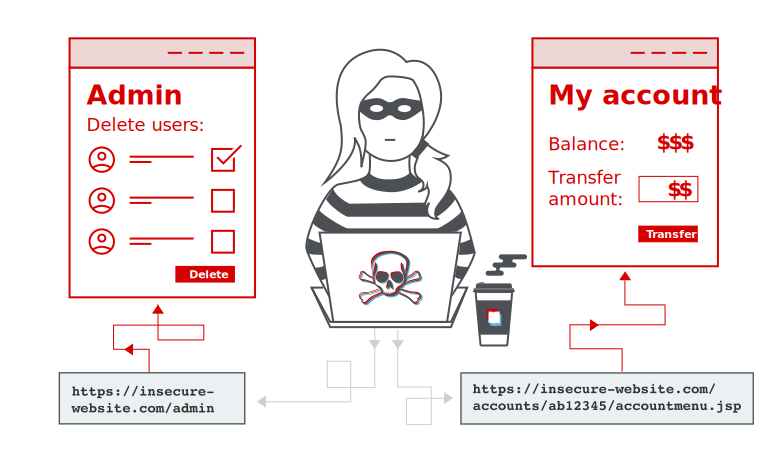

Access control is the application of constraints on who or what is authorized to perform actions or access the resources.

In webapps, this access control is dependent on authentication and session management.

**Authentication** confirms that the user is who they claim to be.
**Session Management** establishes a session and subsequent HTTP requests that are made by the same user.
Access Controls determine if the access is allowed to access or perform operations/actions on the one's they are trying to perform.
## Broken Access Control
#access-controls #owasp #owasp-top-10

Broken Access controls represent a critical security vulnerability.

