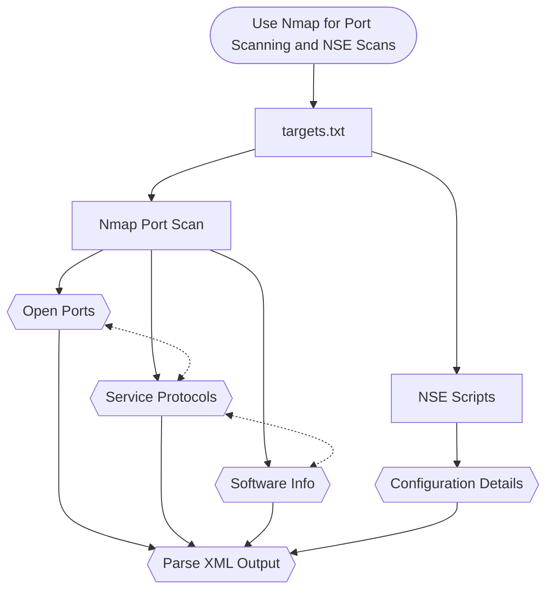

## Port Scanning ?

Regardless of what services are running behind a port, we just try to check if a particular port is opne or closed or filtered. There will be different services running behind different ports. For Example

| Port | Service Running |
|--|--|
|21 | FTP|
|22 | SSH |
|25 | SMTP |
|53| DNS|
|80 | HTTP |
|389 |LDAP |
|443 |HTTPS |
|445 | Microsoft SMB |
|1433 | Microsoft SQL Server|
|3306| MySQL Server|
|5800 | Java VNC Server |
|5900 | VNC Server |

>Virtual Network Computing, or VNC, is an open source application that **provides screen sharing services** and is available for virtually all operating systems such as Windows, Linux, and of course OS X.

When port scanning we need not understand how the services are running and how to work with services, we just focus on status of the port.

## Active or Passive ?

The port scanning can be both passive as well as active based on service detection and aggresion of the scan type, it depends on the scan type. Lets say if we are scanning with `-A` and creating alot of traffic in network then it is active.

## Normal Scanning

```bash
$ nmap -Pn -p 21,22,80,443,445,3306,5800-5900 -iL targets.txt -oA quickscan
```

Here we are scanning without host discovery of mentioned ports and IP's from input file `targets.txt` and saving the output in a file named `quickscan`

## Fingerprinting

Fingerprinting is a process in which we try to gather more information on ports like services running and their versions. For this it establishes a handshake with that port.

> w3challs.com is a testing website we are using here to scan and learn more about port scanning with nmap

Here we try to aggressively scan a particular host to gather as much information as we can using service detection and fingerprinting.

Here if we try scanning any corporate domain, we will create a lot of network traffic for which we are not authorized, Instead we'll scan a training website like `w3challs.com`

```bash
$ nslookup w3challs.com --> 51.15.18.162
$ namp -Pn 51.15.18.162 -p- -sV -A -oA full --min-rate 50000 -vv
```

This takes quite some time to give all the results including service detection scan. To tackle this time problem, first we'll scan with partial connection like we did with `quick`  output.

Based on the open ports from that quick file, we add only those ports in the fingerprinting nmap scan command.


## NSE Scripts

The Nmap Scripting Engine (NSE) is one of Nmap's most powerful and flexible features. It allows users to write (and share) simple scripts (using the [Lua programming language](http://lua.org/) ) to automate a wide variety of networking tasks. Those scripts are executed in parallel with the speed and efficiency you expect from Nmap. Users can rely on the growing and diverse set of scripts distributed with Nmap, or write their own to meet custom needs.

Nmap Scripting Engine default scripts will be stored in /usr/share/local                                                                   /nmap/scripts

