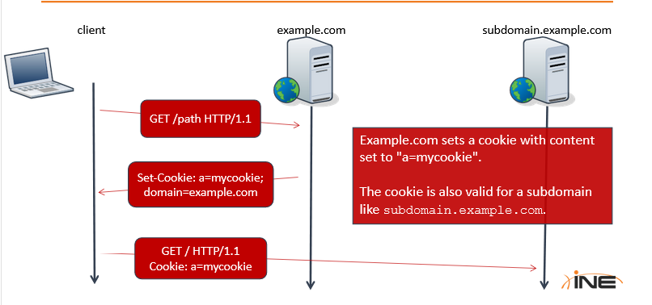

# HTTP Basics
HTTP is a client-server protocol on top of TCP used to transfer web pages and web application data.
It usually connects to web server like IIS or Apache HTTP server. During which the client sends requests and server sends the responses.

It is a TCP connection, once TCP handshake, the clinet starts sending requests.
![image]https://hpbn.co/assets/diagrams/84cf0f29175e4b11a2343e73105637c5.svg


## HTTP Requests:

```
GET / HTML/1.1
Host: www.elearnsecurity.com
User-Agent: Mozilla/5.0 (X11; Linux x86_64; rv:31.0) Gecko ....
Accept: text/html
Accept-Language: en-US, en, q=0.5
Accept-Encoding: gzip, deflate
Connection: keep-alive
```

+ HTTP Verbs are called [request methods](https://developer.mozilla.org/en-US/docs/Web/HTTP/Methods), they are (GET, POST, HEAD, TRACE).
+ The `/` is the path given.
+ `HTML/1.1` is the protocol version.
+ `Host` specifies the internet hostname and port number of resource being requested.
+ `User-Agent` tells about which client software is requesting the server (Firefox, Edge, Chrome). It also reveals the operating system to the server.
+ `Accept` is sent to specify the document type expected from server to client.
+  `Accept-Language` is asking for specific human language.
+  `Accept-Encoding` similar to `Accept` but restricts the content encoding. In the above example, it uses `gzip` and `deflate`.
+  `Connection` header field allows the sender to specify options that are desired for a particular connection.

## HTTP Responses:
```
HTTP/1.1 200 OK
Date: Wed, 10 Jun 2022 14:21:56 IST
Cache-Control: private, max-age=0
Content-Type: text/html; charset=UTF-8
Content-Encoding: gzip
Server: Apache/2.2.15 (CentOS)
Content-Length: 99043

<PAGE_CONTENT>
```

+ Status line is the first line in response and it consists of `HTML/1.1` (protocol version), `200` (status code) and `OK` (its textual meaning).
+ [Common HTTP status codes](https://developer.mozilla.org/en-US/docs/Web/HTTP/Status) are important to understand the behaviour of server on a request. 
+ `Date` represents the Date and time at which the message was originated.
+ `Cache-Control` is used to inform client about cache control. Using cached content saves bandwidth and prevents repeated (unmodifed data) requests (like Username,  contact info, basic info).
+ `Content-Type` lets the client know how to interpret the body of the message.
+ `Content-Encoding` extends `Content-Type`.
+ `Server` header field contains the header of server that generated the content.
+ `Content-Length` is usually in Bytes of the message body.


## HTTPS:
+ HTTP is a clear text protocol and can be easily interpreted by attackers without any authentication from HTTP.
+ To protect HTTP, we add an encryption layer over SSL/TLS (a cryptographic protocol)..
+ HTTPS offers encryption, but doesnt stop attacker from sniffing the network packets. but attacker wont know HTTP Request Header and Response header not Response body.
+ A network adjacent user might recognise `target IP Address` , `target port`, `DNS and similar protocols`.
+ HTTPS doesnot protect against web application flaws.

## Cookies:
+ HTTP is a stateless protocol, websites cannot keep the state of a visit across HTTP requests.
+ To overcome this, Cookies were invented by Netscape at 1994 to make HTTP `stateful`.
+ `Cookie-Jar` is a storage space where cookies are stored in a web browser.

### Cookies Format:
+ A server can set cookie using `Set-Cookie` header field.
+ Contains following attributes:
	+ The actual content
	+ An expiration date
	+ A path
	+ The domain
	+ Optional Flag:
		+ HTTP only flag.
		+ secure flag.

Cookie are sent only to the valid domain/path when they are not expired and according to their flags.

### Cookie Domain:
+ `domain` and `path` fields set the scope of the cookie.
+ Browser sends the cookie only if the request is right for the right domain.
+ When cookie has domain set as `.elearnsecurity.com`, browser will send the cookie to :
	+ www.elearnsecurity.com
	+ whatever.subdomain.elearnsecurity.com
	+ elearnsecurity.com
+ If server does not specify the domain attribute, browser will automatically set the domain as server domain and set cookie `host-only` flag. i.e, the flag will be sent only to that precise host name.
+ 

### Cookie Path:
+ When a cookie path is set to `/the/path`. Browser will send the cookie to right domain and resources in:
	+ `/the/path`
	+ `/the/path/sub`
	+ `/the/path/sub/sub/sub/path`
+ But it will not send it to `/theotherpath`
+ The `expires` attribute sets validity time window of a cookie.
